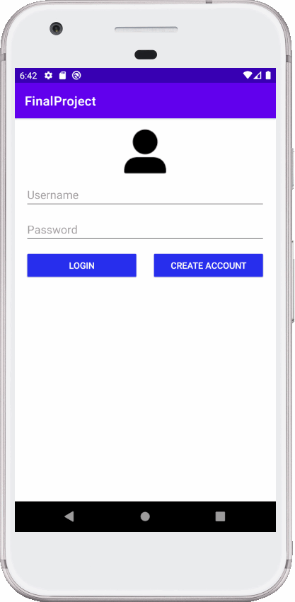
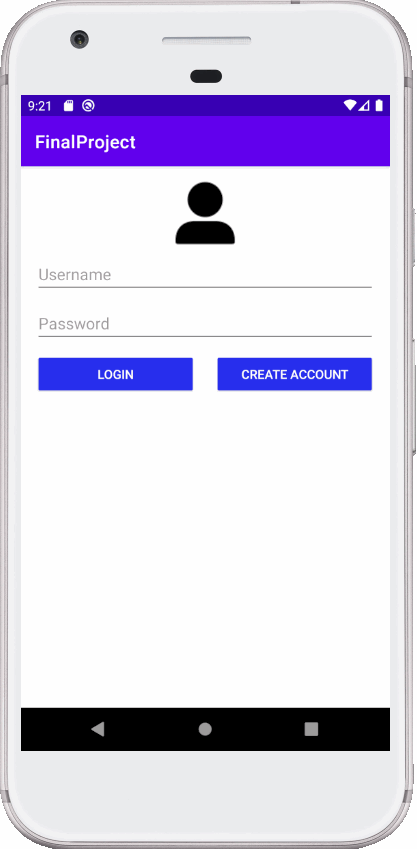
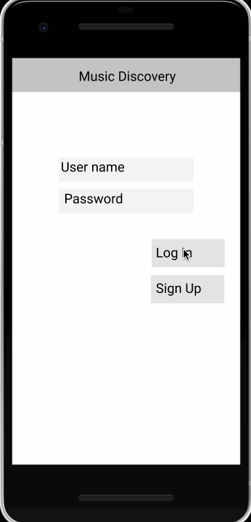

# Music Discovery

## Table of Contents
1. [Overview](#Overview)
1. [Product Spec](#Product-Spec)
1. [Wireframes](#Wireframes)
2. [Schema](#Schema)

## Overview
### Description
Music Discovery allows people to favorite songs and see what songs are popular among other users of the app.

### App Evaluation
- **Category:** Music
- **Mobile:** Our app could also be made for desktop, but would mainly be for mobile devices.
- **Story:** Allows users to see popular songs, like songs, and keep a list of their favorite songs.
- **Market:** People who enjoy listening to music and seeing what music is currently popular is the market for this app.
- **Habit:** This app could be used by users somewhat frequently in order to see new songs which are popularly liked by other users and update their own favorite songs.
- **Scope:** Our app would start with simply showing what is popular among all users and could progress into a social network that users can use to see their friends' favorite songs.

## Product Spec

### 1. User Stories (Required and Optional)

**Required Must-have Stories**

- [x] User can register an account and log in
- [ ] User can search, like, and favorite songs
    - [ ] Songs show title, artist, and album art
- [x] User can view their profile and show their favorited songs
- [x] Settings screen where user can change their password or logout

**Optional Nice-to-have Stories**

- [ ] Songs display how many likes they have received from users
- [ ] Users can view another user's profile to see their favorited songs
- [ ] User can listen to a preview of songs

**Progress gifs**

Sprint 1:<br>
<br>

Sprint 2:<br>
<br>

### 2. Screen Archetypes

* Login screen
    * User can register an account and log in
* Song search screen
    * User can search, like, and favorite songs
* User profile screen
    * User can view their profile and show their favorited songs
* Settings screen
    * Settings screen where user can change their password or logout

### 3. Navigation

**Tab Navigation** (Tab to Screen)

* Song search
* User profile
* Settings

**Flow Navigation** (Screen to Screen)

* Login screen
    * After a user logs in or registers a new account, they are sent to the song search screen
* Song search screen
    * The user will be able to search songs using this screen
    * After entering search parameters, matching songs will be listed and the user will be able to like and favorite the songs
* User profile screen
    * On this screen all of the currently logged in user's favorite songs will be displayed
* Settings screen
    * On this screen the user will be able to change their password or logout of their account

## Wireframes


Wireframe with navigation shown:


Interactive wireframe:
https://www.figma.com/proto/vK3XHi8MqddWZ54iFb2tlf/MusicDiscovery?node-id=2%3A23&scaling=scale-down&page-id=0%3A1

<br>

## Schema 
### Models
#### User
   | Property  | Type      | Description  |
   |-----------|-----------|--------------|
   | userId    | String    | Unique id for the user post (default field) |
   | username  | String    | Username of the user |
   | password  | String    | Hashed password of the user |

#### Favorites
   | Property  | Type            | Description  |
   |-----------|-----------------|--------------|
   | userId    | Pointer to User | User who this favorite is associated with |
   | songId    | Pointer to Song | Song which the user has favorited |

#### Likes
   | Property  | Type            | Description  |
   |-----------|-----------------|--------------|
   | userId    | Pointer to User | User who this favorite is associated with |
   | songId    | Pointer to Song | Song which the user has liked |

#### Song
   | Property  | Type      | Description  |
   |-----------|-----------|--------------|
   | songId    | String    | Spotify ID of the song |
   | name      | String    | Name of song |
   | artist    | String    | Name of song artist |
   | album     | String    | Name of album the song belongs to |
   | image     | String    | URL to image of the art for the album which this song belongs to |
   | likes     | Number    | Number of likes the song has received from users |
   
### Networking
- Login Screen
   - POST requests
      - Create new user
      - Login
- Song Search Screen
   - POST requests
      - Favorite a song
      - Like a song
   - GET requests
      - Search songs
   - DELETE requests
      - Un-favorite a song
      - Un-like a song
- User Profile Screen
   - GET requests
      - Query all favorites from this user
      - Query all likes from this user
- Settings Screen
   - PUT requests
      - Change user password


#### Example Network Requests
POST, create new user:
```
ParseUser user = new ParseUser();
user.setUsername(username);
user.setPassword(password);
// username and password are variables which hold the desired username and password for the user

user.signUpInBackground(new SignUpCallback() {
   @Override
   public void done(ParseException e) {
       if (e != null) {
           Log.e(TAG, "Error creating user.", e);
           return;
       }
       Log.i(TAG, "User successfully created.");
   }
});
```

GET, favorites:
```
ParseQuery<Favorite> query = ParseQuery.getQuery(Favorite.class);
query.whereEqualTo(Favorite.KEY_USER, user);
query.addDescendingOrder(Favorite.KEY_CREATED_AT);
query.findInBackground(new FindCallback<Post>() {
   @Override
   public void done(List<Favorite> foundObjects, ParseException e) {
       if (e != null) {
           Log.e(TAG, "Problem getting favorites", e);
           return;
       }
```
